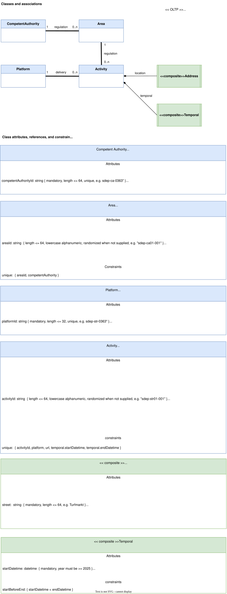

<h1>Architecture</h1>

This document describes the SDEP architecture, including layering principles, data flows, and architectural decisions.

- [Overview](#overview)
- [Layers](#layers)
- [Runtime layers](#runtime-layers)
    - [API (FastAPI)](#api-fastapi)
  - [Schemas (Pydantic)](#schemas-pydantic)
  - [Services (business logic)](#services-business-logic)
  - [CRUD (data access)](#crud-data-access)
  - [Models (SQLAlchemy ORM)](#models-sqlalchemy-orm)
  - [Database (PostgreSQL)](#database-postgresql)
- [Development time layers](#development-time-layers)
  - [Test](#test)
- [Deployment time layers](#deployment-time-layers)
  - [Alembic (database migrations)](#alembic-database-migrations)
- [Data flow](#data-flow)
  - [Request flow (top-down)](#request-flow-top-down)
  - [Response flow (bottom-up)](#response-flow-bottom-up)
- [Dependency rules](#dependency-rules)
- [Business rules](#business-rules)
  - [API layer](#api-layer)
  - [Service layer](#service-layer)
  - [Models layer](#models-layer)
  - [Database layer](#database-layer)
- [Security](#security)
  - [Client credentials grants](#client-credentials-grants)
  - [Defense in-depth](#defense-in-depth)
  - [Authentication \& authorization](#authentication-authorization)
- [Standards](#standards)
  - [API standards](#api-standards)
  - [Naming conventions](#naming-conventions)
  - [Code quality principles](#code-quality-principles)
- [Code generation](#code-generation)
  - [Models from UML diagrams](#models-from-uml-diagrams)
  - [CRUD from models](#crud-from-models)
  - [Services from models](#services-from-models)
  - [Alembic from models](#alembic-from-models)
- [Technology stack](#technology-stack)
  - [Backend (Python 3.13)](#backend-python-313)
  - [Infrastructure](#infrastructure)
- [Configuration](#configuration)


## Overview

SDEP is an online transactional processing (OLTP) application with straight transactional semantics:

- Each endpoint (POST) demarcates one transaction
- Single concurrency for platform or competent authority
- Single delivery without versioning

## Layers

SDEP follows a **layered architecture** pattern

- Distinct layers
- Separation of concerns (each layer has specific responsibilities and dependencies)
- Data flows from top to bottom (one direction)

```
┌─────────────────────────────────────────────────┐
│  API Layer (FastAPI)                            │
│  - HTTP request/response handling               │
│  - Transaction demarcation                      │
│  - OpenAPI/Swagger documentation                │
│  - Input validation via Pydantic schemas        │
└─────────────────────────────────────────────────┘
                     ↓ Depends on
┌─────────────────────────────────────────────────┐
│  Schemas Layer (Pydantic)                       │
│  - (De)serialize JSON                           │
│  - Validate input/output                        │
│  - Transform ORM models to schemas              │
└─────────────────────────────────────────────────┘
                     ↓ Depends on
┌─────────────────────────────────────────────────┐
│  Services Layer (Business Logic)                │
│  - Business logic implementation                │
│  - Optimized queries                            │
│  - Transaction management with savepoints       │
└─────────────────────────────────────────────────┘
                     ↓ Depends on
┌─────────────────────────────────────────────────┐
│  CRUD Layer (Data Access)                       │
│  - Data access (get & flush)                    │
│  - Basic CRUD operations                        │
│  - Pagination support                           │
└─────────────────────────────────────────────────┘
                     ↓ Depends on
┌─────────────────────────────────────────────────┐
│  Models Layer (SQLAlchemy ORM)                  │
│  - Domain model definition                      │
│  - Attribute constraints                        │
│  - Class constraints                            │
│  - Relationship mapping                         │
└─────────────────────────────────────────────────┘
                     ↓ Depends on
┌─────────────────────────────────────────────────┐
│  Database Layer (PostgreSQL)                    │
│  - PostgreSQL 17.6                              │
│  - Psycopg2 adapter                             │
└─────────────────────────────────────────────────┘
```

SDEP is deployed on the [Logius Standaard Platform](https://www.logius.nl/onze-dienstverlening/infrastructuur/standaard-platform).

This platform runs Kubernetes clusters for Test and Production, and amonsgt others is leveraged:

- Nginx reverse proxy (SSL-offloading)
- CNPG operator (PostgreSQL management)
- Daily backup/restore
- Etc.

*Deployment is futher out of scope of this repo, but details can be inquired via SDEP NLD.*

## Runtime layers

The following layers are active during runtime:

#### API (FastAPI)

Location: [`backend/app/api/`](../backend/app/api/)

Responsibilities:

- Transaction demarcation
- HTTP request/response handling
- OpenAPI/Swagger documentation
- Input validation via Pydantic schemas

Technology:

- FastAPI for REST endpoints
- Uvicorn as ASGI server
- Swagger and Redoc for API documentation

Patterns:

- Subapplications for versioning (`/api/v0`, `/api/v1`)
- Routers for logical grouping
- Async patterns with dependency injection
- Proper HTTP status codes and error handling

### Schemas (Pydantic)

Location: [`backend/app/schemas/`](../backend/app/schemas/)

Responsibilities:

- (De)serialize JSON
- Validate input/output
- Transform ORM models to schemas

Technology:

- Pydantic for data validation
- ConfigDict wsdep.gov.nl/ith `from_attributes=True` for ORM conversion

Patterns:

- Separate schemas for input and output (e.g., `UserCreate`, `UserResponse`)
- Field validation with constraints
- Lower camelCase for API contracts

### Services (business logic)

Location: [`backend/app/services/`](../backend/app/services/)

Responsibilities:

- Business logic implementation
- Optimized queries
- Transaction management with optional nested savepoints

Technology:

- SQLAlchemy async patterns
- Python async/await

Patterns:

- Compose custom queries to avoid N+1 problems
- Use CRUD finders when applicable
- Leverage save-update cascades

### CRUD (data access)

Location: [`backend/app/crud/`](../backend/app/crud/)

Responsibilities:

- Data access (get & flush)
- Basic CRUD operations
- Pagination support

Technology:

- SQLAlchemy 2.0+ with async patterns
- Modern `select()` statements

Patterns:

- Implement create, update, delete, exists, count operations
- Implement getters: `get_all`, `get_by_id`, `get_by_[attribute]`, `get_by_[reference]`
- Use `flush()` instead of `commit()` (transaction managed at API layer)
- Include pagination (offset, limit)
- Lazy loading (no eager loading of references)

### Models (SQLAlchemy ORM)

Location: [`backend/app/models/`](../backend/app/models/)

Responsibilities:

- Domain model definition
- Attribute constraints
- Class constraints
- Relationship mapping

Technology:

- SQLAlchemy 2.0+ declarative base
- PostgreSQL-specific column types

Patterns:

- One model per file
- Generated from UML class diagrams (`*.drawio`)
- Audit fields: `created`, `updated` (except supportive classes)
- Optimistic locking: `version` field (except single concurrency classes)
- Composite aggregations for contained relationships
- Explicit foreign keys with proper indexes

SDEP's datamodel is based on this UML class model



The datamodel enforces:

- **Attribute constraints** (mandatoriness, min/max, syntax, ...)
- **Reference constraints** (multiplicity, navigability, composites)
- **Unique constraints** (class attribute or atttributes)
- **Delete constraints** (nullify, restricted, cascased)
- **Class constraints** (e.g. timestampFrom < timestampTo)

These rules are documented in the public OpenAPI specification (a.k.a. Swagger), and apply to knowledge "inside SDEP".

These rules do not apply to "landscape knowledge" (e.g. "does address exist in member state registration system")

### Database (PostgreSQL)

Location: External to application

Technology:

- PostgreSQL 17.6
- Psycopg2 adapter
- CNPG (Cloud Native PostgreSQL) operator for Kubernetes

## Development time layers

The following components are used during development only:

### Test

Location: [`backend/test/`](../backend/test/)

Structure:

- [`test/api/`](../backend/test/api/) - API endpoint tests
- [`test/services/`](../backend/test/services/) - Service layer tests
- [`test/crud/`](../backend/test/crud/) - CRUD layer tests
- [`test/fixtures/`](../backend/test/fixtures/) - Test fixtures using factory_boy
- [`test/security/`](../backend/test/security/) - Security-related tests

Technology:

- pytest with coverage reporting
- factory_boy for test fixtures
- Transaction rollback pattern (no database recreation)

## Deployment time layers

The following components are used during deployment only:

### Alembic (database migrations)

Location: [`backend/alembic/`](../backend/alembic/)

Responsibilities:

- Database migration
- Schema evolution
- Constraint enforcement

Technology:

- Alembic for migration management

Patterns:

- Sequential numbering: `001_synopsis.py`, `002_synopsis.py`, etc.
- Offline migrations (`run_migrations_offline`)
- Generated from SQLAlchemy models
- Implements optimistic locking pattern

Commands:
```
uv run alembic revision --autogenerate -m "Description"
uv run alembic upgrade head
uv run alembic downgrade -1
uv run alembic history
uv run alembic current
```

## Data flow

### Request flow (top-down)

1. **Client** → HTTP request to API endpoint
2. **API layer** → Deserialize & validate via Pydantic schema
3. **Schema layer** → Transform to Python dict
4. **Service layer** → Apply business logic, orchestrate CRUD operations
5. **CRUD layer** → Execute database operations (flush only)
6. **Models layer** → ORM mapping to database
7. **Database** → Store/retrieve data

Transaction commit happens at API layer after successful service completion.

### Response flow (bottom-up)

1. **Database** → Return query results
2. **Models layer** → ORM objects
3. **CRUD layer** → Return ORM objects
4. **Service layer** → Return processed data
5. **Schema layer** → Serialize ORM to Pydantic schema
6. **API layer** → JSON response to client

## Dependency rules

Dependencies flow in one direction: **top-down only**

- API depends on Schemas and Services
- Schemas depend on Models (via `from_attributes=True`)
- Services depend on CRUD and Models
- CRUD depends on Models
- Models depend on Database

**Prohibited dependencies:**

- Lower layers must NOT import from higher layers
- Models must NOT import from CRUD, Services, Schemas, or API
- CRUD must NOT import from Services, Schemas, or API

## Business rules

SDEP enforces business rules at multiple layers (defense in-depth):

### API layer

- Input validation via Pydantic schemas
- Request/response format validation
- OpenAPI specification compliance

### Service layer

- Business logic enforcement
- Transaction boundaries
- Cross-entity validation

### Models layer

- Domain constraints via SQLAlchemy
- Relationship integrity
- Audit trail (created, updated, version)

### Database layer

- Foreign key constraints
- Unique constraints
- Check constraints
- Not-null constraints

## Security

### Client credentials grants

The SDEP API is secured by **client credentials grants** for trusted machine-to-machine (M2M) clients, a.k.a. **oAuth2 with JWT**

- The **oAuth resource server** is the application itself (the API)
  - The resource server protects resources such as areas and rental activity data
- The **oAuth authorization server** runs "behind the scenes" on behalf of the resource server
  - The authorization server hand-outs oAuth2 JWT tokens to SDEP
  - SDEP clients obtain these tokens by submitting their credentials on the SDEP `/token` endpoint
- The **User management** assigns client credentials to:
  - Platforms
  - Competent authorities
  - Other relevant stakeholders
- https://datatracker.ietf.org/doc/html/rfc6749#section-4.4

Each of these will be implemented by each member state.

- Netherlands makes use of Keycloak as authorization server
- https://www.keycloak.org/securing-apps/oidc-layers#_client_credentials

### Defense in-depth

SDEP implements security at multiple layers:

- **API layer**: OAuth2 client credentials flow, JWT validation
- **Schema layer**: Input validation, SQL injection prevention
- **Service layer**: Business logic authorization
- **CRUD layer**: Parameterized queries
- **Models layer**: Constraint enforcement
- **Database layer**: Row-level constraints, foreign keys
- **Alembic layer**: Schema constraints, indexes

### Authentication & authorization

Location: [`backend/app/security/`](../backend/app/security/)

- OAuth2 with client credentials grant (RFC 6749)
- Keycloak as authorization server
- JWT token validation
- Client-specific permissions (platform, competent authority)

## Standards

### API standards

API standards:

- OpenAPI 3.1 conformance
- `Kebab-case` shall be used in services
- Lower `camelCase` shall be used in resources, path parameters and query parameters
- Resource names shall be pluralized
- REST conventions with proper HTTP methods
- Consistent error responses
- Pagination support

References:

- https://logius-standaarden.github.io/API-Design-Rules
- https://unece.org/sites/default/files/2023-07/API-TECH-SPEC_OpenAPI_NDR_version1p0.pdf

### Naming conventions

- **API endpoints**: kebab-case (e.g., `/activity-data`)
- **JSON attributes**: lower camelCase (e.g., `firstName`)
- **Python code**: snake_case (e.g., `get_by_id`)
- **Classes**: PascalCase (e.g., `RentalActivity`)
- **Database tables**: snake_case (e.g., `activity_data`)

### Code quality principles

- **DRY**: Don't repeat yourself
- **Single responsibility**: One purpose per function/module
- **Clean code**: Readable, well-documented
- **Type hints**: Required for all function signatures
- **Function size**: Aim for ≤ 50 lines
- **Security first**: No secrets in code, validate all inputs

## Code generation

Several components are **generated** from source artifacts:

### Models from UML diagrams

Source: [`docs/Classes.drawio`](./Classes.drawio)

Target: [`backend/app/models/*.py`](../backend/app/models/)

Process:

- Parse UML class diagrams
- Generate SQLAlchemy models
- Add audit fields (created, updated, version)
- Map associations to relationships
- Implement composites for aggregations

Principle: **Idempotent generation** (only generate/delete when source differs)

### CRUD from models

Source: [`backend/app/models/*.py`](../backend/app/models/)

Target: [`backend/app/crud/*.py`](../backend/app/crud/)

Process:

- Generate basic CRUD operations for each model
- Exclude `<<composite>>` and `<<supportive>>` stereotypes
- Add pagination support

### Services from models

Source: [`backend/app/models/*.py`](../backend/app/models/)

Target: [`backend/app/services/*.py`](../backend/app/services/)

Process:

- Generate service layer boilerplate
- Implement business logic manually

### Alembic from models

Source: [`backend/app/models/*.py`](../backend/app/models/)

Target: [`backend/alembic/versions/001_initial.py`](../backend/alembic/versions/)

Process:
```
uv run alembic revision --autogenerate -m "Description"
```

## Technology stack

### Backend (Python 3.13)

- **Framework**: FastAPI + Uvicorn
- **ORM**: SQLAlchemy 2.0+ (async)
- **Validation**: Pydantic
- **Database**: PostgreSQL 17.6 + Psycopg2
- **Migrations**: Alembic
- **Testing**: pytest + factory_boy
- **Code quality**: ruff (linting/formatting) + pyright (type checking)
- **Package management**: uv

### Infrastructure

- **IAM**: Keycloak 26
- **Database**: PostgreSQL
- **Containerization**: Docker + docker-compose
- **Deployment**: Kubernetes (outside the scope of this repo)

## Configuration

Configuration is managed by environment variables (12-factor app pattern)

- **`.env` files** (local development)
- **ConfigMaps and Secrets** (Kubernetes)

Key configuration areas:

- Database connection
- Keycloak integration
- API versioning
- CORS settings
- Logging levels
