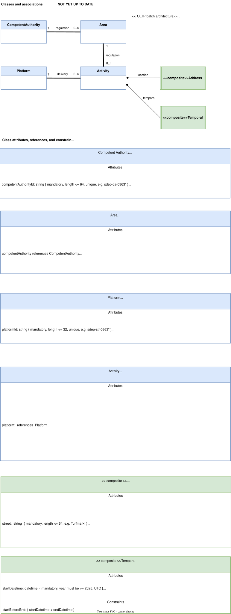

# Data Model Documentation



This document describes the data model for the Single Digital Entrypoint (SDEP) short-term rental regulation system, as defined in `docs/Datamodel.drawio`.

## Overview

The SDEP data model implements an **OLTP (Online Transaction Processing) batch architecture** for managing short-term rental activities and their regulatory framework. The system tracks platforms that deliver rental activities, competent authorities that regulate geographic areas, and the rental activities themselves.

## Architecture Principles

The data model follows these architectural principles:

- **Default Technical Key**: All entities (except composites) have a default `id` technical key attribute
- **Audit Trail**: All entities (except composites) have a default `created_at` attribute for audit purposes
- **Versioning Strategy**: Versioning by stapling (new occurrences)
- **Concurrency Model**: Single concurrency

## Entity Relationship Diagram

The model consists of four main entities and two composite types:

```
CompetentAuthority (1) ---regulation---> (0..n) Area
CompetentAuthority (1) ---delivery-----> (0..n) Activity
Platform (1) ----------delivery-----> (0..n) Activity
Area (1) --------------location-----> (0..n) Activity

Activity uses composites:
  - Address (composite)
  - Temporal (composite)
```

## Entities

### 1. CompetentAuthority

**Purpose**: Represents a regulatory body responsible for short-term rental regulation.

**Location in code**: `backend/app/models/competent_authority.py`

**Attributes**:

| Attribute | Type | Constraints | Example |
|-----------|------|-------------|---------|
| `id` | int | Primary key, auto-increment | 1 |
| `competent_authority_id` | string | Mandatory, unique, length <= 64 | "sdep-ca-0363" |
| `competent_authority_name` | string | Mandatory, length <= 128 | "Gemeente Amsterdam" |
| `created_at` | datetime | Mandatory, UTC, auto-generated | 2025-01-15T10:30:00Z |

**Relationships**:
- `areas`: References 0..n Area entities (one-to-many)

---

### 2. Area

**Purpose**: Defines a geographic region for short-term rental regulation, expressed as a binary shapefile.

**Location in code**: `backend/app/models/area.py`

**Attributes**:

| Attribute | Type | Constraints | Example |
|-----------|------|-------------|---------|
| `id` | string | Primary key, length = 20, auto-generated UUID | "a1b2c3d4e5f6g7h8i9j0" |
| `competent_authority_id` | int | Foreign key, mandatory | 1 |
| `competent_authority_area_id` | string | Optional, length <= 64, lowercase alphanumeric | "sdep-ca01-001" |
| `filename` | string | Mandatory, length <= 64 | "Amsterdam.zip" |
| `filedata` | binary | Mandatory, max size 1MiB | (binary .zip file) |
| `created_at` | datetime | Mandatory, UTC, auto-generated | 2025-01-15T10:30:00Z |

**Relationships**:
- `competent_authority`: References 1 CompetentAuthority (many-to-one, mandatory)
- `activities`: References 0..n Activity entities (one-to-many)

**Notes**:
- The `filedata` contains a .zip file with a collection of ESRI shapefile files
- The shapefile defines the geographic boundary of the area
- `competent_authority_area_id` is randomized when not supplied

---

### 3. Platform

**Purpose**: Represents a short-term rental platform that delivers rental activities to the system.

**Location in code**: `backend/app/models/platform.py`

**Attributes**:

| Attribute | Type | Constraints | Example |
|-----------|------|-------------|---------|
| `id` | int | Primary key, auto-increment | 1 |
| `platform_id` | string | Mandatory, unique, length <= 32 | "sdep-str-0363" |
| `platform_name` | string | Mandatory, length <= 128 | "Booking.com" |
| `created_at` | datetime | Mandatory, UTC, auto-generated | 2025-01-15T10:30:00Z |

**Relationships**:
- `activities`: References 0..n Activity entities (one-to-many)

---

### 4. Activity

**Purpose**: Represents an actual short-term rental activity submitted by a platform.

**Location in code**: `backend/app/models/activity.py`

**Attributes**:

| Attribute | Type | Constraints | Example |
|-----------|------|-------------|---------|
| `id` | string | Primary key, length = 20, auto-generated UUID | "x1y2z3a4b5c6d7e8f9g0" |
| `platform_id` | int | Foreign key, mandatory | 1 |
| `platform_activity_id` | string | Optional, length <= 64, lowercase alphanumeric | "sdep-str01-001" |
| `area_id` | string | Foreign key, mandatory | "a1b2c3d4e5f6g7h8i9j0" |
| `url` | string | Mandatory, length <= 128 | "http://example.com/my-advertisement" |
| `registration_number` | string | Mandatory, length <= 32 | "REG123456" |
| `number_of_guests` | int | Optional, min 1, max 1024 | 4 |
| `country_of_guests` | array of string | Optional, min 1, max 1024 elements, ISO 3166-1 alpha-3 | ["NLD", "DEU", "FRA"] |
| `created_at` | datetime | Mandatory, UTC, auto-generated | 2025-01-15T10:30:00Z |

**Composite Attributes**:
- `address`: Address composite (see below)
- `temporal`: Temporal composite (see below)

**Relationships**:
- `platform`: References 1 Platform (many-to-one, mandatory)
- `area`: References 1 Area (many-to-one, mandatory)

**Business Logic**:
- The host obtains a `registration_number` for the address (conforming to legislation)
- On the platform, the host replicates the registration number in each advertisement (unit)
- If an address is advertised in parts, the registration number is replicated in each Activity
- The `platform_activity_id` is an optional external identifier that platforms may provide
- `platform_activity_id` is randomized when not supplied

---

## Composite Types

Composite types are value objects that don't have their own identity or lifecycle. They are always part of a parent entity (in this case, Activity).

### 5. Address (Composite)

**Purpose**: Represents a physical address where the rental activity takes place.

**Location in code**: `backend/app/models/address.py`

**Attributes**:

| Attribute | Type | Constraints | Example |
|-----------|------|-------------|---------|
| `street` | string | Mandatory, length <= 64 | "Turfmarkt" |
| `number` | int | Mandatory | 147 |
| `letter` | string | Optional, length <= 1 | "a" |
| `addition` | string | Optional, length <= 10 | "5h" |
| `postal_code` | string | Mandatory, length <= 8, no spaces, alphanumeric | "2500EA" |
| `city` | string | Mandatory, length <= 64 | "Den Haag" |

**Storage**: Address fields are stored inline within the Activity table with the prefix `address_`.

---

### 6. Temporal (Composite)

**Purpose**: Represents a time period for the rental activity.

**Location in code**: `backend/app/models/temporal.py`

**Attributes**:

| Attribute | Type | Constraints | Example |
|-----------|------|-------------|---------|
| `start_date_time` | datetime | Mandatory, year >= 2025, UTC | 2025-06-01T14:00:00Z |
| `end_date_time` | datetime | Mandatory, UTC | 2025-06-08T10:00:00Z |

**Constraints**:
- `startBeforeEnd`: `start_date_time` < `end_date_time`

**Storage**: Temporal fields are stored inline within the Activity table with the prefix `temporal_`.

---

## Relationships

### CompetentAuthority → Area (regulation)
- **Cardinality**: 1 CompetentAuthority to 0..n Areas
- **Meaning**: A competent authority can regulate multiple geographic areas
- **Cascade**: When a CompetentAuthority is deleted, associated Areas may need handling

### CompetentAuthority → Activity (delivery)
- **Cardinality**: 1 CompetentAuthority to 0..n Activities (via Area)
- **Meaning**: Activities are indirectly linked to CompetentAuthority through their Area
- **Note**: This is an indirect relationship through the Area entity

### Platform → Activity (delivery)
- **Cardinality**: 1 Platform to 0..n Activities
- **Meaning**: A platform delivers (submits) multiple rental activities
- **Cascade**: When a Platform is deleted, associated Activities may need handling

### Area → Activity (location)
- **Cardinality**: 1 Area to 0..n Activities
- **Meaning**: Multiple activities can occur within the same geographic area
- **Cascade**: When an Area is deleted, associated Activities may need handling

### Activity → Address (composite)
- **Cardinality**: 1 Activity has exactly 1 Address
- **Meaning**: Each rental activity occurs at a specific address
- **Lifecycle**: Address has no independent existence; it lives and dies with the Activity

### Activity → Temporal (composite)
- **Cardinality**: 1 Activity has exactly 1 Temporal
- **Meaning**: Each rental activity occurs during a specific time period
- **Lifecycle**: Temporal has no independent existence; it lives and dies with the Activity

---

## Implementation Details

### Database Schema

The data model is implemented using SQLAlchemy ORM with the following table structure:

- `competent_authority` table (maps to CompetentAuthority entity)
- `area` table (maps to Area entity)
- `platform` table (maps to Platform entity)
- `activity` table (maps to Activity entity, includes denormalized Address and Temporal fields)

### Primary Keys

- **CompetentAuthority** and **Platform**: Use auto-incrementing integer `id`
- **Area** and **Activity**: Use 20-character UUID-based string `id` (lowercase hexadecimal)

### Foreign Keys

- `area.competent_authority_id` → `competent_authority.id`
- `activity.platform_id` → `platform.id`
- `activity.area_id` → `area.id`

### Indexes

The following fields are indexed for performance:

- All primary keys (`id`)
- All foreign keys
- `competent_authority.competent_authority_id` (unique)
- `platform.platform_id` (unique)
- `area.competent_authority_area_id`
- `activity.platform_activity_id`

### Constraints

**Check Constraints**:
- `area.filedata`: Maximum size 1MiB (1,048,576 bytes)
- `activity.number_of_guests`: NULL or between 1 and 1024
- `activity.country_of_guests`: NULL or array length between 1 and 1024 (PostgreSQL only)

**Application-Level Constraints** (enforced in Temporal class):
- `temporal.start_date_time` < `temporal.end_date_time`
- `temporal.start_date_time.year` >= 2025

### Data Types

**Special Handling**:
- **Datetime fields**: All stored in UTC timezone
- **Binary data**: `area.filedata` uses LargeBinary type
- **Arrays**: `activity.country_of_guests` uses:
  - PostgreSQL: Native ARRAY type
  - SQLite: JSON-serialized text (for development/testing)

---

## Consistency Verification

The backend implementation in `backend/app/models/` has been verified to be **fully consistent** with the data model specification in `docs/Datamodel.drawio`:

- All entity attributes match the specification
- All relationships are correctly implemented
- All constraints are enforced
- Composite types follow the prescribed pattern
- Naming conventions are consistent

## Related Documentation

- `docs/Datamodel.drawio` - Visual data model diagram (source of truth)
- `backend/app/models/` - SQLAlchemy model implementations
- `backend/app/schemas/` - Pydantic schema definitions for API validation
