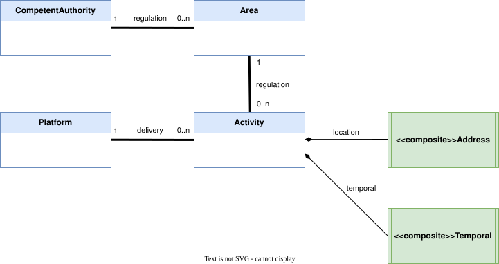

<h1>Data Model</h1>

This UML datamodel represents the SDEP implementation (**internal view**).

It is reflected in the OpenAPI/Swagger datamodel (**external view**).

API-clients should ONLY look at the external view.

<h2>Table of Contents</h2>

- [Classes and associations](#classes-and-associations)
  - [Competent Authority](#competent-authority)
  - [Platform](#platform)
  - [Area](#area)
  - [Activity](#activity)
  - [Address (Composite)](#address-composite)
  - [Temporal (Composite)](#temporal-composite)
- [Associations](#associations)
- [Key Patterns](#key-patterns)
  - [OLTP](#oltp)
  - [ID Management](#id-management)
  - [Versioning](#versioning)
  - [Bulk Processing](#bulk-processing)
  - [Authorization](#authorization)

## Classes and associations

### Competent Authority

**Purpose:** Regulates short-term rental in specific geographic areas

| Attribute                  | Type      | Constraints                                                                                                                                       |
| :------------------------- | :-------- | :------------------------------------------------------------------------------------------------------------------------------------------------ |
| **id**                     | int       | is technical id, mandatory                                                                                                                        |
| **competentAuthorityId**   | string    | is functional id, mandatory, unique, length <= 64, lowercase alphanumeric, is auto-provisioned when receiving first POST from competent authority |
| **competentAuthorityName** | string    | optional, length <= 64, e.g. "Gemeente Amsterdam"                                                                                                 |
| **createdAt**              | datetime  | mandatory, UTC                                                                                                                                    |
| **endedAt**                | datetime  | optional, UTC                                                                                                                                     |
| **areas**                  | reference | optional, references Area                                                                                                                         |

**Class Constraints:** UNIQUE (competentAuthorityId, createdAt)

---

### Platform

**Purpose:** Delivers rental activities to competent authorities

| Attribute        | Type      | Constraints                                                                                                  |
| :--------------- | :-------- | :----------------------------------------------------------------------------------------------------------- |
| **id**           | int       | is technical id, mandatory                                                                                   |
| **platformId**   | string    | is functional id, mandatory, length <= 64, lowercase alphanumeric, is supplied or auto-provisioned otherwise |
| **platformName** | string    | optional, length <= 64, e.g. "Example platform"                                                              |
| **createdAt**    | datetime  | mandatory, UTC                                                                                               |
| **endedAt**      | datetime  | optional, UTC                                                                                                |
| **activities**   | reference | optional, references many Activity                                                                                |

**Class Constraints:** UNIQUE (platformId, createdAt)

---

### Area

**Purpose:** Defines a geographic region for short-term rental regulation

| Attribute              | Type        | Constraints                                                                                                             |
| :--------------------- | :---------- | :---------------------------------------------------------------------------------------------------------------------- |
| **id**                 | int         | is technical id, mandatory                                                                                              |
| **areaId**             | string      | is functional id, mandatory, length <= 64, lowercase alphanumeric, is supplied or auto-provisioned otherwise (RFC 6749) |
| **areaName**           | string      | optional, length <= 64, e.g. "Amsterdam-Noord"                                                                          |
| **createdAt**          | datetime    | mandatory, UTC                                                                                                          |
| **endedAt**            | datetime    | optional, UTC                                                                                                           |
| **competentAuthority** | reference   | mandatory, references single Competent Authority                                                                               |
| **filename**           | string      | mandatory, length <= 64, e.g. "Amsterdam.zip"                                                                           |
| **filedata**           | largeBinary | mandatory, max size 1MiB, e.g. a .zip with a collection of ESRI shapefile files                                         |
| **activities**         | reference   | optional, references many Activity                                                                                           |

**Class Constraints:** UNIQUE (areaId, competentAuthority, createdAt)

**Notes:**
- Same `areaId` can be resubmitted to create new versions with different timestamps
- Filedata contains shapefiles, these define geographic boundaries for regulatory purposes
- Retrieved as binary octet-stream via GET `/str/areas/{areaId}`

---

### Activity

**Purpose:** Represents an actual rental activity submitted by a platform

| Attribute              | Type            | Constraints                                                                                                             |
| :--------------------- | :-------------- | :---------------------------------------------------------------------------------------------------------------------- |
| **id**                 | int             | is technical id, mandatory                                                                                              |
| **activityId**         | string          | is functional id, mandatory, length <= 64, lowercase alphanumeric, is supplied or auto-provisioned otherwise (RFC 6749) |
| **activityName**       | string          | optional, length <= 64, e.g. "Summer rental"                                                                            |
| **createdAt**          | datetime        | mandatory, UTC                                                                                                          |
| **endedAt**            | datetime        | optional, UTC                                                                                                           |
| **platform**           | reference       | mandatory, references single Platform                                                                                   |
| **area**               | reference       | mandatory, references single Area                                                                                       |
| **url**                | string          | optional, length <= 128, e.g. http://example.com/my-advertisement                                                       |
| **address**            | reference       | mandatory, references single Address composite                                                                                 |
| **registrationNumber** | string          | mandatory, length <= 32                                                                                                 |
| **numberOfGuests**     | int             | optional, min 1, max 1024                                                                                               |
| **countryOfGuests**    | array of string | optional, min 1, max 1024, each ISO 3166-1 alpha-3                                                                      |
| **temporal**           | reference       | mandatory, references single Temporal composite                                                                                |

**Class Constraints:** UNIQUE (activityId, platform, createdAt)

**Notes:**
- Same `activityId` can be resubmitted to create new versions with different timestamps
- Each activity must reference an existing area

---

### Address (Composite)

**Purpose:** Structured address information for rental activities

| Attribute      | Type   | Constraints                                                  |
| :------------- | :----- | :----------------------------------------------------------- |
| **street**     | string | mandatory, length <= 64, e.g. Turfmarkt                      |
| **number**     | int    | mandatory, e.g. 147                                          |
| **letter**     | string | optional, length <= 1, e.g. "a"                              |
| **addition**   | string | optional, length <= 10, for example 5h                       |
| **postalCode** | string | mandatory, length <= 8, no spaces, alphanumeric, e.g. 2500EA |
| **city**       | string | mandatory, length <= 64, e.g. Den Haag                       |

---

### Temporal (Composite)

**Purpose:** Time period information for rental activities

| Attribute         | Type     | Constraints                     |
| :---------------- | :------- | :------------------------------ |
| **startDatetime** | datetime | mandatory, year must be >= 2025 |
| **endDatetime**   | datetime | mandatory                       |

**Constraint:** startDatetime < endDatetime

## Associations

- **CompetentAuthority** defines many **Areas**
- **Platform** submits many **Activities**
- **Activity** references one **Area** (geographic location)
- **Activity** embeds one **Address** (rental location details)
- **Activity** embeds one **Temporal** (rental time period)
- Activities are routed to CompetentAuthorities based on the referenced Area

## Key Patterns

### OLTP
- Bulk updates
- Single concurrency (no optimistic locking)

### ID Management

Technical IDs
- Represent technical keys, on the **“inside”** (under the hood)
- These are used for referential integrity within the database

Functional IDs
- Represent business identifiers, on the **“outside”**
- Are client-provided (optional), or auto-generated otherwise (RFC 9562 UUIDs, except for `platformId` and `competentAuthorityId`, which are supplied by the authorization provider)
- After a POST, functional IDs are always returned/made visible
- This allows them to be reused in subsequent submissions
- Functional IDs enable versioning (in combination with a timstamp)

Soft-Delete Guard
- When all versions of a functional ID have `endedAt` set (no current version), the entity is considered **deactivated**
- Creating a new version with a deactivated functional ID is rejected (HTTP 422)
- This prevents "resurrecting" soft-deleted entities
- The guard applies to: `competentAuthorityId`, `platformId`, `areaId`, and `activityId`

https://datatracker.ietf.org/doc/rfc9562/

### Versioning
- Stacking (new occurrences)
- Entities use `(functionalId, createdAt)` as unique constraint
- Same functional ID can be resubmitted with new timestamp for versioning
- Enables historical tracking and updates without losing previous versions

### Bulk Processing
- All POST endpoints support bulk operations (1-1000 records per request)
- Independent processing with savepoints (nested transactions)
- Partial success/failure support - some records can succeed while others fail
- Response includes detailed success/failure breakdown with indices

### Authorization
- **Platforms:** Require `sdep_str` role
  - `sdep_write` for POST operations (submitting activities)
  - `sdep_read` for GET operations (reading areas)
- **Competent Authorities:** Require `sdep_ca` role
  - `sdep_write` for POST operations (submitting areas)
  - `sdep_read` for GET operations (reading activities)
